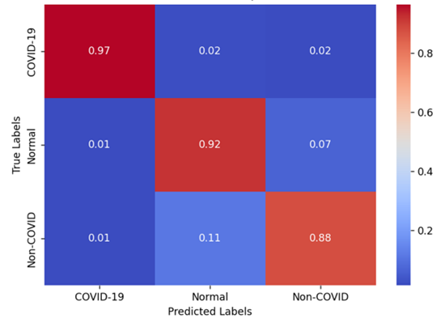

# 

 ## ABSTRACT
This project focuses on building a deep learning model based on the Residual Network (ResNet) architecture combined with the Convolutional Block Attention Module (CBAM) to detect COVID-19 from chest X-ray images. By utilizing this architecture, the model is expected to improve detection performance by focusing on more relevant features in the images. The goal of this project is to clearly demonstrate the superiority of this model over the ResNet18 model in classifying chest X-ray images. 
 

## Overview
The COVID-19 pandemic, caused by the SARS-CoV-2 virus, has had a profound and long-lasting impact on global healthcare systems and economies. According to a report by the World Health Organization (WHO) on August 9, 2023, more than 760 million confirmed cases and 6.9 million deaths have been recorded worldwide, although the actual figures are likely higher. This pandemic has created an urgent need for rapid, accurate, and scalable diagnostic tools to effectively control transmission and support timely treatment.

While PCR testing is an effective diagnostic method, it requires advanced infrastructure and highly trained personnel, which limits its accessibility in resource-constrained areas. On the other hand, diagnosing COVID-19 through chest X-ray imaging heavily relies on the expertise of radiologists, which can pose challenges in timely and accurate detection. Therefore, the development of deep learning models that can automatically detect COVID-19 from chest X-ray images has become essential to support healthcare professionals, reduce diagnostic time, and improve accuracy.
 
 
## Project goals
This project focuses on developing a deep learning model based on the Residual Network architecture enhanced with the Convolutional Block Attention Module (CBAM) to improve the performance of COVID-19 diagnosis using chest X-ray images. CBAM allows the model to focus on the most relevant features in the image, thereby enhancing classification accuracy. The proposed model’s effectiveness is evaluated through comparison with the standard ResNet-18 architecture, highlighting the advantages of integrating attention mechanisms in deep learning for medical image analysis.

By improving diagnostic precision and reliability, this model can assist healthcare professionals in quickly and effectively identifying COVID-19 cases and contribute to better preparedness for future public health crises.
 
 

## Data Source
This study uses the COVID-QU-Ex dataset developed by Qatar University, which contains 33,920 chest X-ray (CXR) images divided into three categories: COVID-19 (11,956 images), non-COVID pneumonia (11,263 images), and normal (10,701 images). All images are provided with lung segmentation masks, and a subset also includes infection masks, supporting the analysis of COVID-19 severity. 
 
<b>Dataset: </b>
<a href="https://www.kaggle.com/datasets/anasmohammedtahir/covidqu/data">kaggle Dataset</a>
 
 
## Result
The deep learning model integrated with the Convolutional Block Attention Module (CBAM) and ResNet-18 have been tested for classifying chest X-ray images. The results demonstrate that the CBAM model outperforms ResNet-18 in detecting COVID-19.

In addition to training the CBAM model, I also trained and tested ResNet-18 simultaneously. In the code I uploaded to GitHub, there is no code for ResNet-18, but you just need to change the selected model for training and testing, as well as the number of color channels in the dataset file, test, and train that I uploaded, to be compatible with ResNet-18 if you also want to compare performance.

Loss in validation: 

| **Loss visualization**  |
|-------------------------|
|  |

Accuracy in validation: 

| **Loss visualization** |
|--|
|  |

Confusion Matrix:

| **CBAM Confusion Matrix**                                                          | **ResNet-18 Confusion Matrix** |
|------------------------------------------------------------------------------------|--|
|  |  |

Classification Report:

| **CBAM Confusion Matrix**                                       | **ResNet-18 Confusion Matrix** |
|-----------------------------------------------------------------|--|
|  |  |
 
 

## Conclusion
